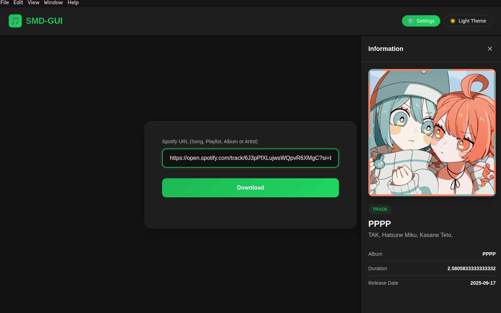
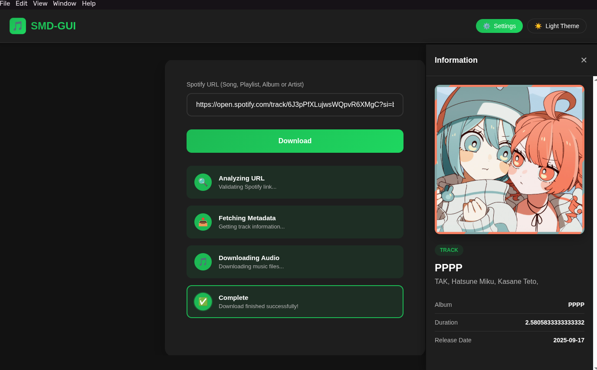

# 🎵 smd-gui

[](https://github.com/vortique/smd-gui)
[](LICENSE)
[](https://github.com/vortique/smd-gui/commits/main)
[](https://github.com/vortique/smd-gui/issues)
[](https://github.com/vortique/smd-gui)

A simple Electron GUI that helps download music using Spotify track information and YouTube (via `yt-dlp`).

This project is under active development. The app uses track metadata from Spotify to find and download matching audio from YouTube, then converts it to an audio file.

---

## Languages

- [English](README.md)
- [Turkish](README_TR.md)

---

**Why this project?**: It provides a lightweight, cross-platform desktop interface to fetch tracks by Spotify URL and download them using bundled `yt-dlp` binaries and `ffmpeg`. And most importantly, I will be using this program. So it should exist.

**Status**: Early development — track/playlist/artist/album download supported, but program lacks of customization and error handling.

**Supported platforms**: Linux, macOS, Windows (prebuilt `yt-dlp` binaries are included under `binaries/`).

**Untested platforms**: OpenBSD. According to the yt-dlp repository, the `binaries/linux/yt-dlp` binary should also work with OpenBSD, but I'm not sure about that.

**Note**: This project bundles `yt-dlp` binaries in `binaries/` for convenience.

## Table of Contents

- **Features**
- **Roadmap**
- **Prerequisites**
- **Installation**
- **Usage**
- **Preview**
- **Development**
- **Packaging**
- **Contributing**
- **Legal Notice**
- **License**

## Features

- **Simple single-track download**: Enter a Spotify track URL to fetch metadata and download a matching YouTube audio.
- **Playlist/Album/Artist download support**: Enter the Spotify URL of what you want to download, and download as many songs as you want by limiting download number.
- **Bundled binaries**: Includes `yt-dlp` executables for each OS in `binaries/` to make running simpler.
- **Audio conversion**: Uses `ffmpeg` (via `ffmpeg-static-electron`) to convert downloads to common audio formats.

## Roadmap

- [x] Single track download
- [x] Playlist download
- [x] Album download
- [x] Artist tracks download
- [x] Custom download directory
- [ ] Download queue
- [ ] Multi-format export
- [ ] Youtube Music support (maybe)

## Prerequisites

- **Node.js**: v16+ (or compatible with the project's Electron version)
- **npm** or **pnpm**: to install dependencies and run scripts

## Installation

Clone the repo and install dependencies:

```bash
git clone https://github.com/vortique/smd-gui.git
cd smd-gui
npm install
```

Run the Electron app in development:

```bash
npm start
```

The `start` script runs `electron .` (see `package.json`).

## Usage

- Launch the app with `npm start`.
- Paste a Spotify track URL into the GUI input and submit.
- The app will search YouTube (via `yt-dlp`) for the best matching result, download the video, and convert it to audio.
- Downloaded files and temporary files location depends on OS; temporary files goes to your OS's temp file directory and Downloaded songs goes to your OS's musics directory (for now).

### How It Works?

Downloading part of the program works like this:

1. Get Spotify URL
2. Get Spotify ID from URL
3. Get Access Token from Spotify (if needed)
4. Fetch metadata of URL via Spotify API
5. Give metadata to yt-dlp and make a search from YouTube according to metadata
6. Download found video according to metadata
7. Extract the sound from downloaded video with FFmpeg and save it

## Preview

**Preview of information panel**:


**Preview of downloading a song**:


**NOTE**: These screenshots are only for preview and downloading is just a simulation.

## Development

- Open the project in your editor (e.g., `code .`).
- Install dependencies: `npm install`.
- Start the app: `npm start`.

Helpful file references:

- **Main process**: `src/main/main.js`
- **Renderers**: `src/renderer/renderer.js`, `src/renderer/options-renderer.js`
- **Preload scripts**: `src/renderer/preload/preload-main.js`, `src/renderer/preload/preload-options.js`
- **yt-dlp helpers**: `src/main/yt-dlp/yt-dlp-binary-executors.js`, `src/main/yt-dlp/installers.js`

## Packaging

The project includes a `build` section in `package.json` that preserves `binaries/` as extra resources. Use your preferred Electron packager (e.g., `electron-builder` or `electron-packager`) and ensure `binaries/` is copied into the final app bundle.

Example (if using `electron-builder`):

```bash
# install electron-builder (optional)
npm install --save-dev electron-builder
# build for current platform (example)
npx electron-builder
```

## Contributing

Contributions, bug reports, and feature requests are welcome. Please open issues or submit pull requests. When contributing, include a clear description of the change and, if applicable, steps to reproduce and test.

## Legal Notice

This project does not provide or encourage downloading copyrighted content.
Users are responsible for ensuring they have the rights to download and use the audio they fetch.

## License

This project is licensed under the MIT License — see `LICENSE` for details.
